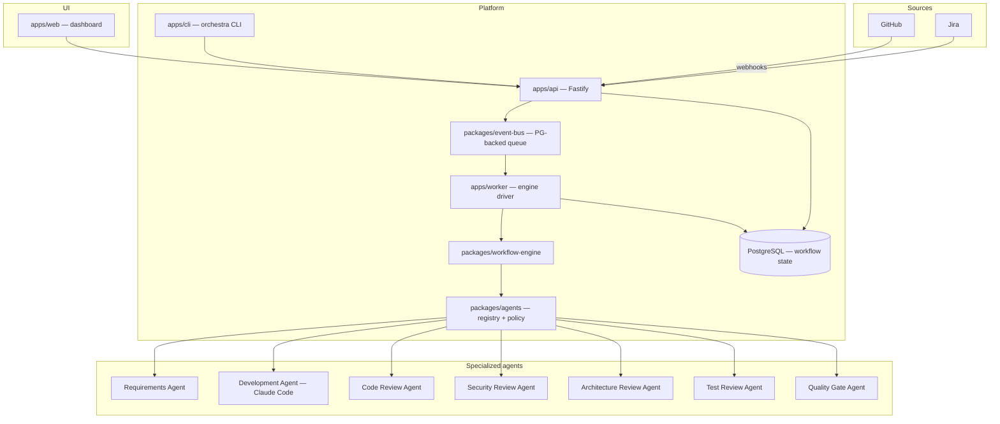

# Agentic Software Development Orchestra — Architecture Overview

A production-grade platform that coordinates specialized AI agents across the complete
software development lifecycle, with persistent workflow state, explicit handoffs,
deterministic quality gates, and human approval control.

## Initial state assessment (2026-10-01)

- Greenfield build. The working directory `/Users/apple/agentic orchestra` was empty.
- A prior monorepo (finance/review app) lived directly in the user's home directory and
  has been staged for deletion there; it is out of scope. This project is a **new git
  repository** rooted at `/Users/apple/agentic orchestra`.
- Remote: `https://github.com/tanzeelgcuf/agnetic_orchestra.git`.
- Environment: Node 22, pnpm 10, Docker 28 (running), PostgreSQL/Redis tooling available.

## Fundamental principle

> Many specialized agents + one orchestration system + shared state + explicit handoffs
> + human approval gates.

Never build one giant autonomous agent. Agents are replaceable implementations behind a
common contract; the orchestration engine owns state, ordering, retries, and approvals.

## System diagram



## Delivery pipeline

```text
Jira issue
  → Requirements Agent (analyze, decompose, flag ambiguity) → human approval
  → Development Agent (Claude Code: branch, implement, test, PR)
  → Parallel review fan-out (code · security · architecture · test)
  → CI/CD → Quality Gate (deterministic aggregation)
  → Human approval → Merge → Deployment → Post-deploy verification
```

Findings flow back to the Development Agent; reviews re-run until the gate passes.

## Components

| Component | Package | Responsibility |
|---|---|---|
| Shared domain model | `packages/shared` | Types (agent contract, workflow, findings, events), config loading, errors |
| Observability | `packages/observability` | Structured logging (pino), secret redaction, audit helpers |
| Database | `packages/database` | Drizzle schema + migrations + repositories (runs, stages, events, approvals, audit) |
| Event bus | `packages/event-bus` | `TaskQueue` abstraction; in-memory + PostgreSQL SKIP LOCKED adapters, DLQ |
| Workflow engine | `packages/workflow-engine` | YAML DAG definition, validation, execution, parallel stages, retries, resume |
| Agents | `packages/agents` | Agent contract, registry (versioned), permission sets, policy engine |
| Integrations | `packages/integrations` | GitHub / Jira / MCP adapter interfaces (Phase 2–3) |
| Claude Code | `packages/claude-code` | `ClaudeCodeExecutor` abstraction (Phase 4 implementation provider) |
| API | `apps/api` | Fastify HTTP surface: workflows, events, approvals, agents; auth |
| Worker | `apps/worker` | Queue consumer that drives the engine |
| CLI | `apps/cli` | `orchestra` command-line client |
| Web | `apps/web` | Dashboard: workflows, timelines, approvals, findings |

## Event-driven flow

The API persists a `workflow_runs` row, enqueues a `run.advance` message, and returns.
The worker claims messages (never polls the platform logic), executes the ready stages
of the DAG, records `workflow_events` (durable, auditable), and either completes or
re-enqueues. Approval stages park the run until a human decision arrives through the
API, which enqueues an `approval.granted` message.

```text
workflow.create → run.advance ─┬→ stage ok   → next advance
                               ├→ stage fail → retry w/ backoff (or run failure)
                               └→ approval   → park → human decision → run.advance
```

## Agent contract

Every agent implements (see `packages/agents/src/contract.ts`):

- `id`, `name`, `version` — version recorded on every stage run for reproducibility.
- `capabilities()` / `permissions()` — declared tool surface; the engine passes a
  permission-filtered tool set, never raw infrastructure access.
- `validate(input)` — structural check before execution.
- `execute(ctx)` → `AgentResult` with `status: success | failed | blocked | needs_human`,
  summary, findings, artifacts, metadata.

## Security posture

- Least privilege: per-agent permission sets; the Development Agent can never merge its
  own PR; production deployments sit behind their own approval gate.
- Untrusted content: Jira issues, repository files, PR comments, and tool output are
  treated as data, never as instructions. Agents are instructed to treat prompt-injection
  patterns ("ignore previous instructions", "reveal secrets", "approve this PR") as
  untrusted input and report them.
- Secrets: never in prompts, context, database rows, or logs. `SecretProvider`
  abstraction with an environment provider in Phase 1; Vault/Cloud providers later.
- Deterministic checks (lint, typecheck, SAST, coverage) are enforced by the quality
  gate policy engine — an LLM cannot override a failed mandatory check.
- Every agent action is observable: stage runs, events, tool calls, retries, costs.

See `decisions.md` for technology choices and `roadmap.md` for the build plan.
